# Cómo funciona el sistema de sensores de agua (WQS-LB) — explicación para el equipo

Este documento explica, en lenguaje simple, cómo StormCIP recibe y procesa las
lecturas de calidad de agua de las sondas Dragino WQS-LB durante un ciclo CIP
(el lavado de las líneas de la planta). Está pensado para alguien que no
participó en el desarrollo: evita asumir que ya sabes qué es un decoder, un
webhook o un ID determinista, y usa comparaciones con cosas cotidianas para
explicarlos.

Para el detalle técnico completo (formato exacto de los bytes, esquema de
Firestore, decisiones de diseño) hay dos documentos de referencia que este
texto resume pero no reemplaza:
- `Base de datos/modelo-datos-sensores.md`
- `Aplicación/stormcip/README.md`

## 1. Qué hace el sistema

Una unidad WQS-LB, con sus sondas conectadas, mide la calidad del agua durante
un ciclo de lavado CIP (pH, conductividad, turbidez, temperatura) y manda esos
datos por radio (LoRaWAN) hacia la nube; el sistema StormCIP recibe esos datos,
los traduce de un formato binario a números con sentido, verifica que sean
físicamente posibles y que correspondan a un ciclo de lavado que esté
efectivamente en curso, y los guarda en la base de datos para mostrarlos en el
dashboard y generar alertas si algo se sale de rango.

## 2. Cómo viaja un dato: del sensor al dashboard

```mermaid
flowchart LR
    A["Unidad WQS-LB + sondas<br/>(pH · conductividad · turbidez · temperatura)"] -->|LoRaWAN, binario| B["Gateway LoRaWAN"]
    B --> C["The Things Stack<br/>(Network Server)"]
    C -->|"Webhook HTTP<br/>frm_payload + f_port + received_at"| D["ttnUplink<br/>(lorawanAdapter.ts)"]
    D -->|"bytes crudos"| E["wqsDecoder.ts<br/>(el traductor)"]
    E -->|"valores numéricos"| F["ingest.ts<br/>(el filtro de calidad)"]
    F -->|"lectura válida"| G[("Firestore")]
    G --> H["Dashboard"]
```

1. **La unidad WQS-LB** junta lo que miden sus sondas (pH, conductividad,
   turbidez, temperatura) y lo empaqueta en un mensaje binario — no manda
   texto ni JSON, manda una fila de bytes, como un código de barras.
2. **El gateway LoRaWAN** es la antena que escucha esa transmisión de radio y
   la reenvía a internet.
3. **The Things Stack (TTS)** es el servicio que administra la red LoRaWAN:
   recibe el mensaje del gateway y lo entrega a quien esté suscrito, en este
   caso, vía un **webhook** — un aviso automático por internet ("oye,
   llegó un mensaje nuevo, te lo mando a esta URL").
4. **`ttnUplink`** (dentro de `lorawanAdapter.ts`) es la puerta de entrada de
   StormCIP para ese aviso. Revisa que venga con la contraseña correcta
   (`x-webhook-secret`) y que sea del tipo de mensaje que le interesa
   (FPort=2, la lectura en tiempo real); también es quien busca si existe un
   ciclo de lavado en curso en esa línea, para saber a cuál asignarle la
   lectura (el sensor no lo sabe: solo manda sus mediciones).
5. **`wqsDecoder.ts`** es el traductor: toma la fila de bytes y la convierte en
   números con nombre (`ph: 7.34`, `turbidez: 251.0`, etc.). Para traducir
   bien necesita saber el "dialecto" — la versión de firmware del equipo —
   porque el mismo byte significa algo distinto según la versión (ver
   sección 5). Si no reconoce el dialecto o los bytes no encajan, no
   adivina: dice "no entiendo este formato" y no sigue.
6. **`ingest.ts`** es el filtro de calidad: revisa que cada valor traducido
   sea físicamente posible para esa sonda (¿puede un sensor de pH decir 33?
   no, el rango es 0–14) antes de guardar la lectura.
7. **Firestore** es donde queda guardada la lectura, ya limpia y validada.
8. **El dashboard** lee esos datos guardados para mostrárselos al operador.

## 3. Las piezas principales

- **`wqsDecoder.ts`** — el traductor. Recibe los bytes crudos y la versión de
  firmware, y devuelve los valores numéricos o un error explícito ("formato
  no soportado") si algo no calza. No sabe nada de Firestore ni de ciclos:
  solo traduce.
- **`lorawanAdapter.ts`** — el cartero. Recibe el aviso de TTS, verifica la
  contraseña, le pasa los bytes al traductor, decide si la lectura debe
  seguir su curso (¿hay un ciclo en marcha en esa línea?) y, si todo calza,
  se la entrega al filtro de calidad. Si algo no corresponde (dispositivo
  desconocido, formato raro, sin ciclo activo), lo ignora sin generar error
  ruidoso — para que TTS no insista reintentando algo que nunca va a
  funcionar.
- **`ingest.ts`** — el filtro de calidad y el archivador. Revisa que cada
  valor sea del tipo correcto y esté dentro de lo físicamente posible para
  esa sonda, y guarda la lectura (y las alertas, si algo se sale del umbral
  de proceso) con un "folio" — un identificador fijo que hace que reenviar
  el mismo dato dos veces no cree dos registros (más sobre esto en la
  sección 5).
- **`types.ts`** — el catálogo. Define qué sondas existen, qué mide cada una,
  y en qué rango es físicamente posible que reporten un valor (por ejemplo,
  un pH tiene que estar entre 0 y 14; si llega un 33, algo está roto, no es
  un dato válido).
- **`seed.js`** — la puesta en escena. Antes de poder probar nada, alguien
  tiene que dejar cargados los datos base en la base de datos de prueba: la
  planta, la línea, el dispositivo WQS-LB con sus sondas, un ciclo de lavado
  en curso. Eso es lo que hace este script.
- **`simulador-ttn.js`** — el doble de riesgo. Actúa exactamente como si
  fuera el sensor real (manda el mismo tipo de aviso que mandaría TTS), para
  poder probar todo el flujo sin tener un sensor físico ni una cuenta de
  TTS.
- **`config.js`** — la libreta de direcciones compartida. Un solo lugar
  donde `seed.js` y `simulador-ttn.js` se ponen de acuerdo en contra qué
  proyecto de Firebase están hablando, para no terminar cada uno marcando a
  un número distinto.

## 4. Qué variables mide y por qué

La configuración elegida para este proyecto usa tres sondas RS485 más un
sensor de temperatura DS18B20 que se conecta con un cable aparte a la unidad
WQS-LB (no es una sonda RS485 ni viene integrado en el transmisor — es
externo y opcional, ver manual sección 1.9), con firmware 1.2:

| Sonda | Variable | Qué dice sobre el ciclo CIP |
|---|---|---|
| **DR-PH01** | ph y temperatura (desde phTemp) | El pH es lo que define si la solución de cada etapa (ácida o alcalina) está en el punto correcto. Esta sonda es además la **fuente principal de temperatura** del sistema: su lectura de temperatura (`phTemp`) se guarda como la variable genérica `temperatura` — la misma que usan los umbrales de proceso y el dashboard. Sin el DS18B20 conectado, el sistema sigue teniendo temperatura de todas formas, porque viene de aquí. |
| **DR-ECK10.0** | conductividad + `ecTemp` | La conductividad indica qué tan concentrado está el químico y, sobre todo, **cuándo termina el enjuague**: cuando el agua vuelve a ser agua limpia, la conductividad cae. Importante: esta sonda se satura en 20.000 µS/cm, y una solución de soda cáustica de un CIP alcalino puede superar ese valor con facilidad — sirve para detectar el punto de corte del enjuague, no para medir la concentración real del químico durante las etapas químicas (ver sección 7). |
| **DR-TS1** | turbidez | La turbidez es la señal de arrastre de suciedad: cuánta materia en suspensión sigue saliendo, típica para decidir cuándo un enjuague ya limpió lo suficiente. |
| **DS18B20** (sensor externo, se conecta por cable a la unidad; no es una sonda RS485) | `tempExterna` | Es una fuente de temperatura **adicional y opcional** — por ejemplo, para medir en otro punto de la línea. Si no está conectado, esa variable simplemente queda en `null`; no afecta la variable `temperatura` principal, que viene del pH. |

`firmware: "1.2"` es el dato que le dice al traductor (`wqsDecoder.ts`) qué
"dialecto" usar para leer los bytes de esta unidad en particular (ver
sección 5).

## 5. Historial de problemas y cambios

Esta es la cronología real de qué no funcionaba, por qué, y cómo se resolvió
— desde el diseño original hasta la última prueba con emuladores. El orden
sigue el historial de git y las sesiones de trabajo documentadas.

| # | Qué no funcionaba | Por qué | Cómo se resolvió |
|---|---|---|---|
| 1 | Las sondas se modelaban con un "puerto" libre (cualquier sonda en cualquier puerto) | El WQS-LB en realidad identifica cada sonda por un tipo fijo (un bit dentro del mensaje), no por un puerto que se pueda elegir | Se quitó el campo `puerto`: ahora una sonda es solo "qué modelo es" |
| 2 | El diseño original asumía que el sensor mandaba un mensaje con el `cicloId` y la `etapa` del lavado incluidos | El sensor real no sabe nada de ciclos de lavado: solo manda sus mediciones en binario | El sistema busca por su cuenta el ciclo que esté "en curso" en la línea de ese dispositivo, y usa la etapa actual de ese ciclo |
| 3 | No se podía leer el PDF del manual del fabricante (falta una herramienta en el entorno de trabajo) | Sin poder leer el manual, no había forma de confirmar el formato exacto de los bytes | Se transcribió a mano el texto de las secciones relevantes del manual a un archivo de texto (`WQS-LB-payload-extracto.md`), marcando qué es texto original y qué es una interpretación propia |
| 4 | El decoder oficial de Dragino (el que se descarga de GitHub) es para la versión de firmware 1.1 | Con firmware 1.2, que agrega una temperatura extra por cada sonda, ese decoder leía las columnas corridas: interpretaba la temperatura de una sonda de conductividad como si fuera el pH (un pH real de 7.00 aparecía como 2.73) | Se construyó un traductor propio (`wqsDecoder.ts`) que distingue el formato según la versión de firmware del equipo |
| 5 | El formato de los bytes cambia con cada versión de firmware, y el detalle de las versiones nuevas no está documentado en el manual | Sin saber exactamente cuántos bytes esperar, es fácil "leer columnas corridas" sin darse cuenta | El traductor calcula el largo exacto que debería tener el mensaje según qué sondas están presentes, y si no calza, dice "formato no soportado" en vez de adivinar |
| 6 | El registro de cambios del fabricante dice que la versión 1.2 agregó una temperatura al sensor de oxígeno disuelto, pero la tabla del manual no la incluye | Dos fuentes oficiales se contradicen y no hay forma de confirmar cuál es correcta sin un equipo real | El traductor prueba las dos posibilidades (con y sin esa temperatura) y usa la que hace que el largo del mensaje calce exactamente |
| 7 | La primera versión del traductor contaba dos veces esa misma temperatura del oxígeno disuelto al calcular cuántos bytes esperar | Al construir la lógica para el punto anterior, esa temperatura se sumó tanto en la cuenta general como en la cuenta especial para las dos hipótesis | Las pruebas automáticas lo detectaron (fallaban los casos "con" y "sin" esa temperatura); se corrigió separando el conteo |
| 8 | Los datos de prueba (`seed.js`) usaban una sonda de turbidez (`DR-TS200`) | Según el registro de cambios, ese modelo recién es compatible desde firmware 1.3.1 — una versión que el traductor todavía no soporta | Se cambió a `DR-TS1`, que sí es compatible con el formato actual |
| 9 | Si el sensor de temperatura externo no estaba conectado, la lectura llegaba en `null` y esto podía hacer que se rechazara toda la lectura completa | `null` significa "sensor no conectado", no "dato inválido", pero el filtro de calidad no distinguía entre ambos casos | Se agregó el DS18B20 como una entrada más del catálogo de sondas, y se dejó de exigir rango/pertenencia cuando el valor es `null` |
| 10 | Se iba a crear una variable nueva (`phTemp`) para la temperatura de la sonda de pH | Los umbrales de proceso y el dashboard ya usaban la variable genérica `temperatura`; crear una nueva habría dejado esa lectura sin umbral y fuera del dashboard | Se revirtió: la temperatura que reporta la sonda de pH se guarda como `temperatura`, no como una variable nueva |
| 11 | Las alertas podían quedar duplicadas | Si TTS reintenta el mismo aviso (por ejemplo, porque no recibió confirmación a tiempo), el sistema podía procesarlo dos veces y crear dos alertas iguales | Se le dio a cada alerta un identificador fijo, calculado a partir de la lectura y la variable — como el folio de una boleta: si repites los mismos datos, es la misma boleta, no una nueva |
| 12 | Si la fecha del mensaje (`received_at`) llegaba vacía o con un formato que no se podía interpretar, el identificador de la lectura quedaba con "NaN" en vez de un número | Todas las lecturas en esa situación habrían usado el mismo folio roto y se habrían sobrescrito entre sí, perdiendo datos sin avisar | Ahora, si la fecha no se puede interpretar, el sistema ignora ese mensaje (y lo anota en un registro para revisar) en vez de generar un folio inválido |
| 13 | Las pruebas automáticas (Vitest) fallaban de forma intermitente | Vitest también estaba corriendo, por error, los archivos de prueba ya compilados a JavaScript (carpeta `lib/`, generada al compilar), que no son compatibles con la forma en que Vitest los ejecuta | Se configuró Vitest para que ignore esa carpeta |
| 14 | Se pensaba que las sondas de cloro y de demanda química de oxígeno (COD) podían no ser compatibles con esta unidad | El manual y el registro de cambios confirman que el hardware sí las soporta (se agregaron en versiones de firmware posteriores) | Se corrigió la documentación: lo que falta no es la compatibilidad, sino conocer el detalle exacto de cómo se codifican esas sondas en las versiones de firmware nuevas |
| 15 | Una sonda (`DR-DO2`, oxígeno disuelto para agua salada) figuraba en la lista de sondas ya soportadas | Según el registro de cambios, esa sonda se agregó junto con COD en una versión de firmware posterior a la que el traductor soporta hoy | Se corrigió: pasa a la lista de sondas pendientes, junto con COD |
| 16 | Al probar contra los emuladores de Firebase, el sistema respondía "no autorizado" (401) | El emulador no estaba leyendo el archivo `.env.local` donde se había puesto la contraseña del webhook — probablemente por la versión de la librería de Firebase Functions usada en el proyecto, aunque no se confirmó la causa exacta | Se puso la contraseña en un archivo `.env` (sin el `.local`), que el emulador sí lee |
| 17 | Al intentar levantar los emuladores desde PowerShell, no se encontraba el programa Java (aunque sí estaba instalado en el computador) | PowerShell estaba resolviendo la ubicación de los programas instalados (el PATH) de forma distinta a otras terminales, en esa máquina en particular | Se levantan los emuladores desde `cmd.exe` en vez de PowerShell |
| 18 | El simulador no encontraba la función en el emulador local (error 404) | Los datos de prueba (`seed.js`) y el simulador (`simulador-ttn.js`) tenían escrito cada uno el nombre de un proyecto de Firebase distinto | Se centralizó ese nombre en `config.js`, usado por ambos scripts, y se levanta el emulador indicando explícitamente el mismo proyecto (`--project stormcip-dev`) |
| 19 | No se podía probar automáticamente que reenviar el mismo dato no genera duplicados | El simulador generaba una fecha nueva en cada ejecución (así que cada envío parecía una lectura distinta), y además la etapa de lavado de prueba no tenía ninguna alerta configurada para comparar | Se agregó un quinto caso al simulador que reenvía el mismo mensaje con la misma fecha fija; para además comprobar que las alertas no se duplican, hay que cambiar a mano la etapa del ciclo de prueba a "alcalino" antes de correrlo |
| 20 | Se consideró usar el comando `npm run serve` para levantar el entorno de prueba | Ese comando puede terminar levantando solo el emulador de las funciones en la nube, sin los emuladores de la base de datos ni de autenticación — y en ese caso, las funciones podrían escribir por error en la base de datos real, no en una de prueba | Se descartó: los emuladores siempre se levantan todos juntos, desde la carpeta raíz del proyecto |

## 6. Cómo probarlo

Para probar todo el flujo sin un sensor físico ni una cuenta de The Things
Stack, se usan los emuladores de Firebase junto con `seed.js` (para tener
datos base) y `simulador-ttn.js` (que actúa como si fuera el sensor real,
incluyendo el caso 5 que prueba que reenviar el mismo dato no lo duplica). La
guía paso a paso, con los comandos exactos y qué esperar de cada uno, está en
`Aplicación/stormcip/README.md`.

## 7. Qué no hace todavía

Este sistema tiene límites conocidos que todavía no están resueltos. El
detalle completo está en la sección 7 ("Limitaciones y trabajo futuro") de
`Base de datos/modelo-datos-sensores.md`; en resumen, agrupado en 5
temas:

- **El traductor y las versiones de firmware**: hay sondas (cloro, COD, EC de
  4 electrodos, turbidez de mayor rango) que el hardware soporta pero que el
  traductor todavía no puede leer, porque el fabricante no publicó cómo se
  codifican en las versiones de firmware nuevas. Además, si un equipo tiene
  una de esas versiones nuevas y no tiene su firmware registrado en el
  sistema, el traductor podría "adivinar" un formato antiguo y devolver
  valores incorrectos en vez de avisar que no puede leerlo.
- **El registro histórico (datalog)**: el equipo puede guardar mediciones
  cuando se cae la conexión, pero el sistema todavía no procesa esas
  mediciones atrasadas (asignarles el ciclo de lavado correcto no es trivial
  porque corresponden a un momento pasado). Y en la versión de firmware más
  nueva, esa función de guardado ya no existe: si se cae la red, esas
  lecturas se pierden para siempre.
- **El proceso de lavado (CIP) y el hardware de las sondas**: el equipo manda
  datos cada 20 minutos por defecto, lo que puede ser más lento que algunas
  etapas cortas del lavado; y las sondas actuales están pensadas para agua de
  enjuague, no para las condiciones más extremas (alta temperatura, químicos
  concentrados) de las etapas ácida y alcalina.
- **Datos fuera de un ciclo de lavado**: si no hay un ciclo "en curso" en la
  línea, las lecturas que llegan se descartan sin guardar nada. Esto significa
  que si una sonda falla entre dos ciclos, eso recién se nota cuando empieza
  el ciclo siguiente y llega la primera lectura — no hay una alerta de "sonda
  que dejó de responder" mientras no hay un lavado en curso.
- **Nunca se probó con un sensor real**: todo lo descrito en este documento se
  validó con el simulador (`simulador-ttn.js`) contra los emuladores de
  Firebase — nunca contra un sensor WQS-LB físico ni un uplink genuino de The
  Things Stack. En particular, quedan dos supuestos sin confirmar con un
  equipo real: que el divisor de `ecTemp` (la temperatura de la sonda de
  conductividad) es `/10`, y cuál de las dos hipótesis sobre la temperatura
  del oxígeno disuelto es la correcta (ver fila 6 de la sección 5) — ninguna
  de las dos se puede comprobar sin un uplink real que las use.
